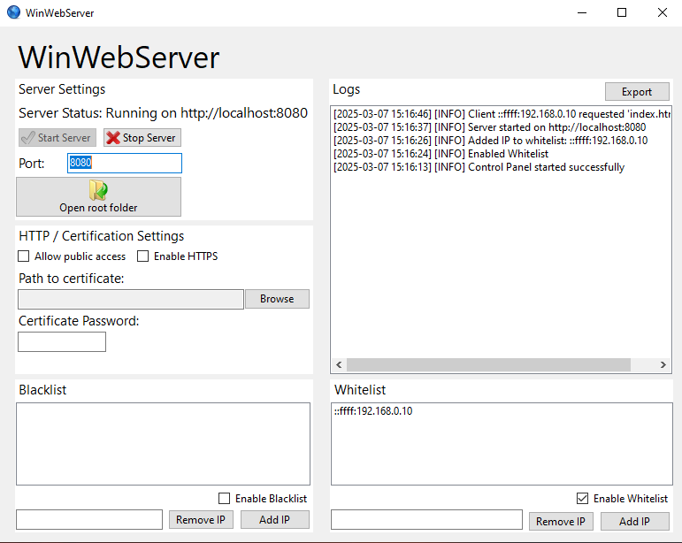
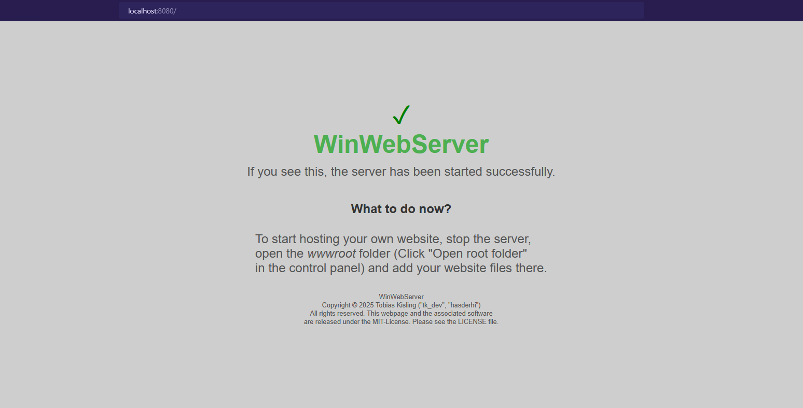
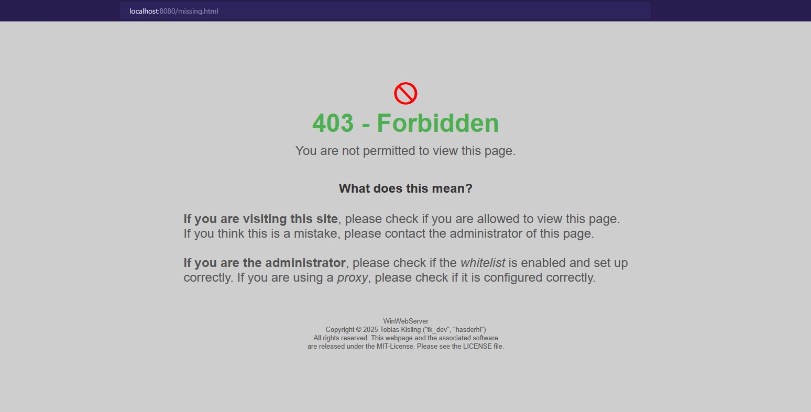

# WinWebServer

A basic but functional web server written in C# using .NET with Windows Forms.
This server is able to host sites both locally and on the internet (through port forwarding),
supports HTTPS and can use certificates from a .pfx file. It also supports
black-/whitelisting of IP addresses. The server is able to serve static files.

It has a logging system that logs all requests to a file, errors or actions taken
from the control panel.

It also is completely open-source and released under the MIT-License.
All icons used are from the [Must Have Icons](https://www.iconarchive.com/show/must-have-icons-by-visualpharm.html) icon set.

## [Download latest release](https://github.com/hasderhi/WinWebServer/releases)

## Table of Contents

1. [Features](#features)
2. [Installation](#installation)
3. [User Manual](#user-manual)
4. [Contributing](#contributing)

## Features

- **Static File Serving**: The server can serve static files from the root directory of the server.
- **Online Hosting**: The server can host sites on the internet through port forwarding.
- **Local Hosting**: The server can host sites locally, which can be very useful for testing or with a small network.
- **HTTPS Support**: WinWebServer supports HTTPS and can use certificates from a .pfx file.
- **Black-/Whitelisting**: The server can blacklist or whitelist IP addresses to control who can access the server.
- **Logging**: The server logs all requests to a file, including errors or actions taken from the control panel. The logs are kept in a format that is easy to read and can also be saved as .log files.
- **Open-Source**: WinWebServer is completely open-source and released under the MIT-License. This means that anyone can use, modify or distribute the code.

## Installation

To install WinWebServer, you need to have .NET installed on your system. You can download .NET from the [official Microsoft website](https://dotnet.microsoft.com/en-us/download). You can also run the .exe and you will be prompted to install .NET. After you have downloaded .NET, you can install the latest release of WinWebServer from the [GitHub repository](https://github.com/hasderhi/WinWebServer/releases). The files will contain the executable named `WinWebServer.exe`.

*Windows Defender will likely warn you that the file is not trusted, this is because I am not a verified publisher. You can safely ignore this warning (Although I completely understand why you would not want to, it's generally not a good idea to ignore warnings from Windows Defender). If you want to be extra safe, you can check the code yourself and build it in Visual Studio 2022*

In the repository, you will also find the source code in order to build the project yourself, which is recommended if you either want to make changes to the code or if you want to verify the integrity of the code. This could be necessary because the developer cannot verify the application because of the lack of a digital signature.

## User Manual

### Starting the Server

To start the server, you need to run the `WinWebServer.exe` executable. This will open the control panel of the server. You can then start the server by clicking the "Start Server" button. The default port is `:8080`. If you want to use a different port, you can change it in the "Port" field. Now you can access the server by going to `http://localhost:8080` in your web browser or, if you have selected a different port, by going to `http://localhost:port` in your web browser.

You should now see something like this:

### Hosting a Site

Now you can start creating your own web pages and upload them to the server. You can do this by clicking the "Open root folder" or by navigating to the `wwwroot` folder in the application directory. You can put any static files in this folder, like HTML, CSS, JavaScript, images, etc.

**Important: Please always make sure that the start page of your site is named `index.html`.** This is because the server will always try to forward users to `index.html` if they don't specify a page.

### Online Hosting

To host a site online, you need to forward the port that the server is using. This can be done by using a port forwarding tool like [Port Forwarding](https://www.portforward.com/), or if you want to do it yourself:

1. Log into your router (usually 192.168.1.1 or 192.168.0.1).
    - Find Port Forwarding settings.
    - Forward TCP port 8080 (or the chosen port) to your computer's local IP (ipconfig in CMD to check).
2. Firewall Configuration:
    - Open Windows Defender Firewall.
    - Click "Advanced settings".
    - Under Inbound Rules, create a new rule:
        - Port → 8080
        - Protocol → TCP
        - Allow Connection → Enabled for Public/Private.
3. Check Public IP:
    - Go to a site like [WhatIsMyIP](https://whatismyip.com) to find your public IP. Your site should be accessible at http://*YOUR_PUBLIC_IP*:8080.

**Attention: Please be VERY CAREFUL when forwarding ports. This can be a security risk if not done securely. The author of this software is not responsible for any damage corresponding to the use of this feature.**

### Black-/Whitelisting

The server can blacklist or whitelist IP addresses to control who can access the server. You can do this by checking the "Blacklist" or "Whitelist" checkbox in the control panel and then entering the IP addresses you either want to block or allow. The server then will only allow or block the specified IP addresses.

### Error pages

For errors that affect the end user, the server will display an error message. For 404 (Not found) and 403 (Forbidden) errors, the server will display a custom error page. You can modify these pages by going to `errors` in the application directory and modifying the files `404.html` and `403.html`.

 404 error page

 403 error page

### Logging

The server logs all requests to a file, including errors or actions taken from the control panel. The logs are shown in the panel on the top-right and are structured like this:

Requests:
`[YYYY-MM-DD HH:MM:SS] [INFO] Client [IP] requested [URL / File]`

HTTP Errors:
`[YYYY-MM-DD HH:MM:SS] [ERROR] [CODE] requested [URL / File] - Not found`

HTTP Unauthorized:
`[YYYY-MM-DD HH:MM:SS] [ERROR] [CODE] Unauthorized access attempt from [IP]`

Control panel actions: `[YYYY-MM-DD HH:MM:SS] [INFO] [ACTION]`

Internal errors: `[YYYY-MM-DD HH:MM:SS] [ERROR] [MESSAGE]`

The logs also can be saved to a .log or .txt file for further analysis.

### Contributing

Contributions are what make the open-source community such an amazing place to learn, inspire, and create. Even though so far I am the only contributer, any contributions you make are ***greatly appreciated***.

If you have a suggestion that would make this better, please fork the repository and create a pull request!

### License

Copyright (c) 2025 [Tobias Kisling ("tk_dev", "hasderhi")]

This software is licensed under the MIT License. See the [LICENSE](LICENSE.txt) file for more information. All icons used in this project are from [Must Have Icons Pack](https://www.iconarchive.com/show/must-have-icons-by-visualpharm.html) from [VisualPharm](https://www.visualpharm.com/).

# tk_dev - Software with Passion
